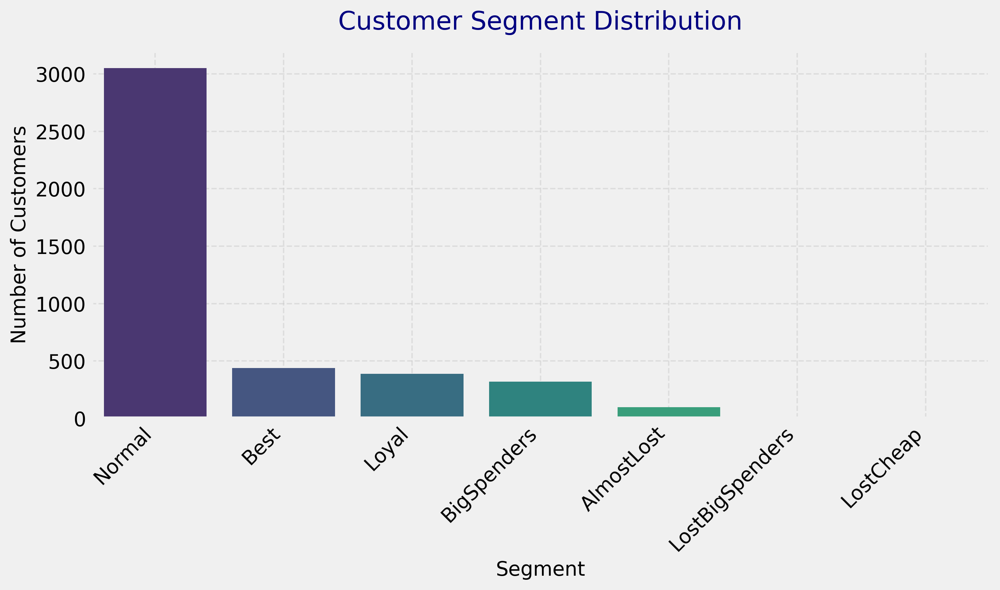
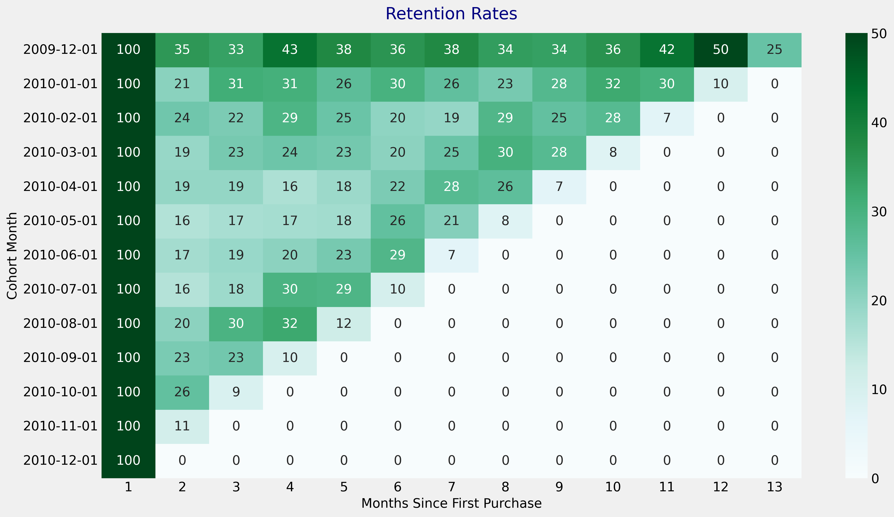

# Customer Insights Analytics


a comprehensive data analysis project that dives deep into customer behavior using real-world sales data. This repository contains five Jupyter Notebooks, each tackling a distinct phase of customer analytics, from data preprocessing to advanced RFM (Recency, Frequency, Monetary Value) segmentation and cohort-based retention analysis. Built with Python, Pandas, Matplotlib, and Seaborn, this project is designed to provide actionable insights for marketing teams aiming to optimize customer retention and value.

## Project Overview

This project analyzes a retail sales dataset to uncover patterns in customer purchasing behavior. It consists of five phases, each implemented in a separate Jupyter Notebook:

1. **Data Preprocessing** (`final_project_1_preprocessing.ipynb`): Cleans and prepares the raw sales data, handling missing values, data types, and outliers to ensure a reliable dataset for analysis.
2. **Exploratory Data Analysis (EDA)** (`final_project_2_eda.ipynb`): Visualizes key metrics like sales trends, top products, and customer demographics to understand the dataset's structure and identify opportunities.
3. **Sales Forecasting** (`final_project_3_forecasting.ipynb`): Applies time-series techniques to predict future sales, enabling better inventory and marketing planning.
4. **RFM Analysis** (`final_project_4_rfm.ipynb`): Segments customers into groups (e.g., Best, Loyal, Lost) based on Recency, Frequency, and Monetary Value, with professional visualizations like bar charts, box plots, and scatter plots to highlight segment characteristics.
5. **Retention Analysis** (`final_project_5_retention_rate.ipynb`): Calculates and visualizes customer retention rates using a cohort-based heatmap, showing the percentage of customers who return each month after their first purchase.

## Key Features

- **Robust Data Pipeline**: End-to-end workflow from raw data cleaning to advanced analytics.
- **Insightful Visualizations**: Includes bar charts, box plots, scatter plots, and heatmaps to make insights accessible and actionable.
- **Customer Segmentation**: RFM analysis categorizes customers into meaningful segments for targeted marketing strategies.
- **Retention Insights**: Cohort analysis reveals retention trends, helping identify opportunities to improve customer loyalty.
- **Professional Code**: Well-documented, with error handling, logging, and modular functions for scalability.

## Visual Highlights

### RFM Segment Distribution


### Retention Rate Heatmap


## Getting Started

### Prerequisites
- Python 3.10+
- Libraries: `pandas`, `numpy`, `matplotlib`, `seaborn`, `joblib`

Install dependencies:
```bash
pip install -r requirements.txt
